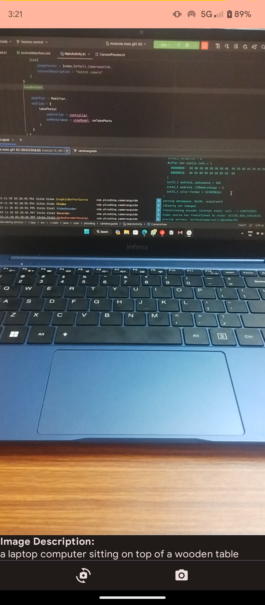

# PicScribe

An Android application leveraging AI technology to generate real-time text captions for camera previews. The app opens the camera upon launch, and uses advanced image recognition algorithms to describe the scene in a concise and accurate manner. It uses the HuggingFace nlpconnect/vit-gpt2-image-captioning model hosted on an API

## Tech Stack

**Client:** Kotlin, Python, Jetpack Compose

**Server:** Python

## Screenshots

